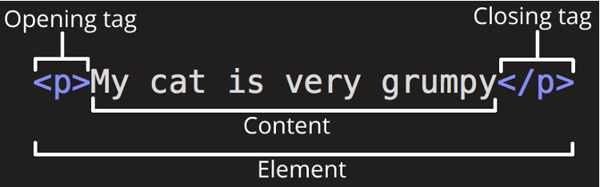
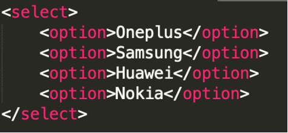
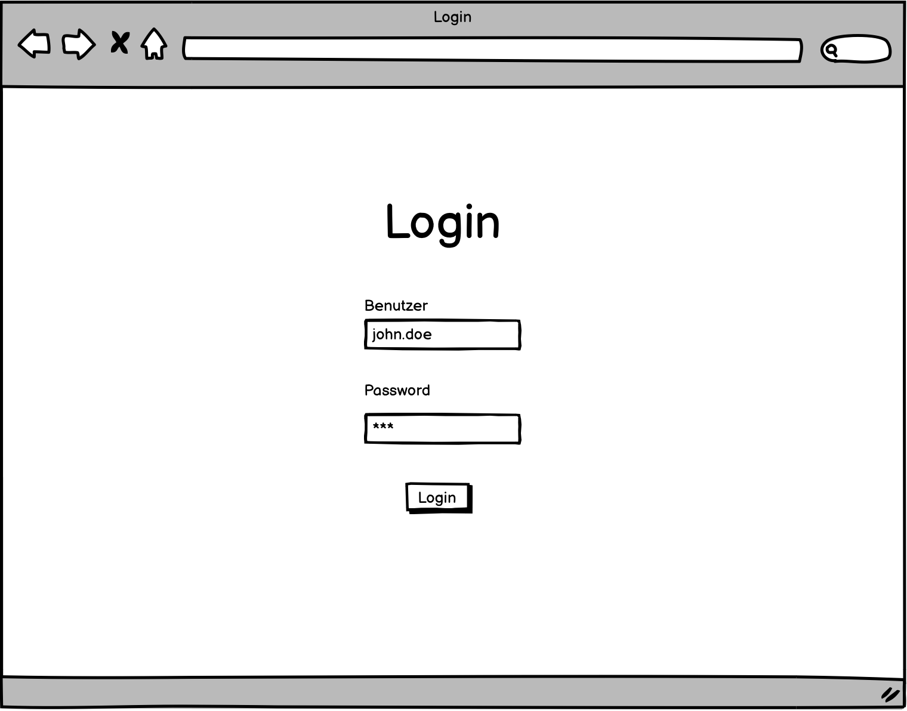
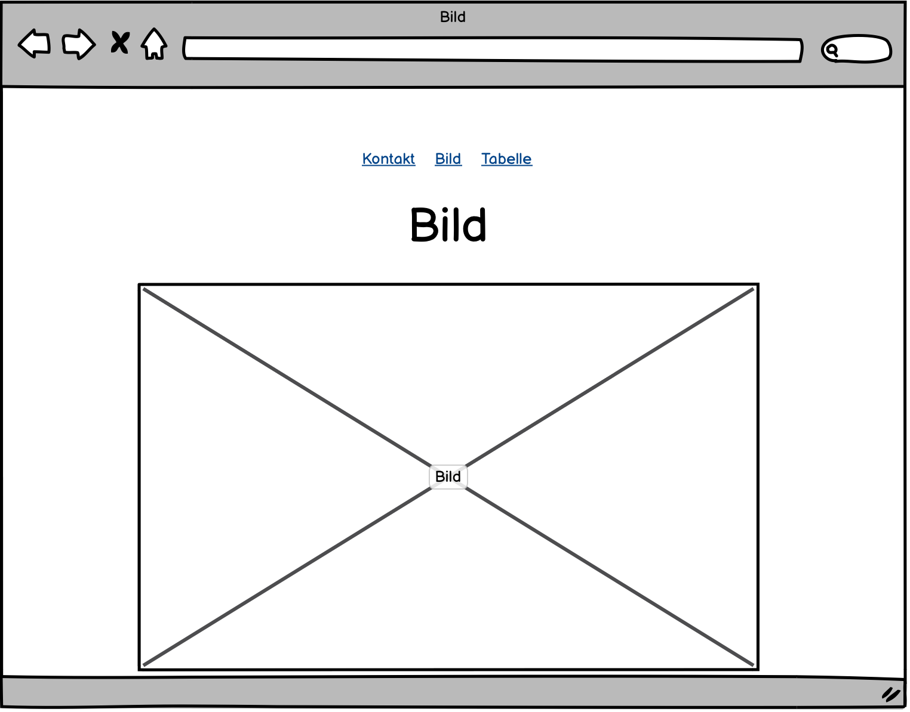
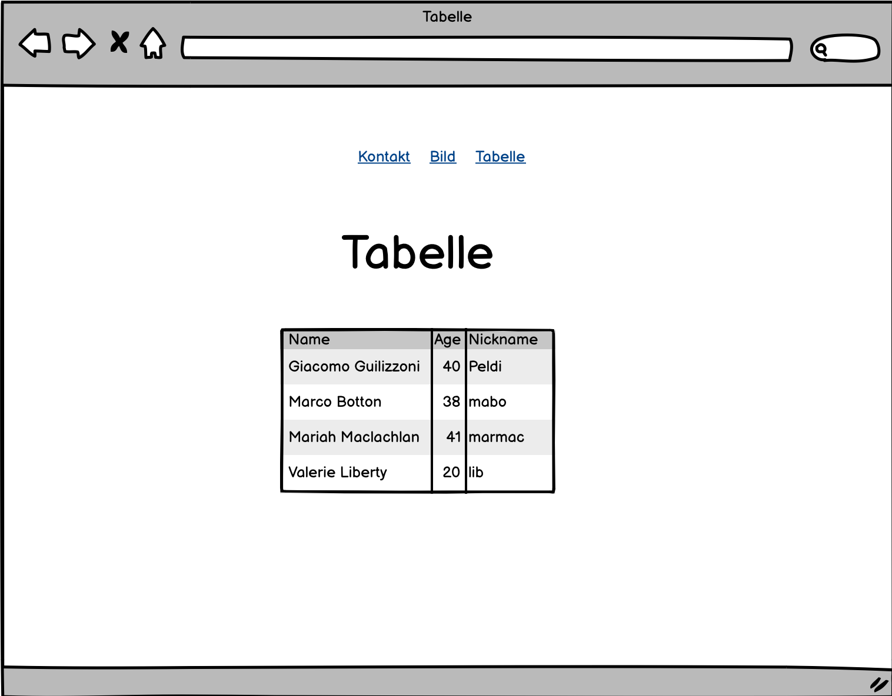

# HTML

HTML steht für _Hyper Text Markup Language_. Fast überall im Internet findet man HTML. Auch in E-Mail Newslettern wird HTML gerne gebraucht.  

## Tags im Allgemeinen

Tags sind Anweisungen in spitzen Klammern. Ein vollständiges Tag benötigt dabei immer ein öffnendes (&lt;p>) und schliessendes (&lt;/p>) Tag. Ein HTML-File stellt sich aus drei grundlegenden Tags zusammen. Nämlich dem &lt;html>, &lt;head > und &lt;body>. Zusätzlich gibt es noch hunderte weitere solche Tags mit verschiedensten Anweisungen. Diese können auch ineinander verschachtelt werden.

Siehe Beispiele für Tags unter: [w3schools.com](https://www.w3schools.com)

## Div-Container

Ein Div-Container kann verwendet werden um Teile der Webseite besser zu strukturieren oder zum CSS-Klassen identifizieren. Dabei ist zu merken, dass Div-Containers in der natürlichen Form über keine Farbe, fixe Grösse oder sonstige Eigenschaften besitzen.

## Text-Eigenschaften
### Titel
Um einfache Überschriften zu generieren, können die Tags &lt;h1> bis &lt;h6> verwendet werden.

### Paragraph
Um Texte einfach strukturieren zu können wird häufig der &lt;p> Tag verwendet.

### Zeilenumbruch
Um einen Zeilenumbruch zu forcieren kann der &lt;br> Tag verwendet werden.

### Kursiv
Für eine kursive Schrift kann der HTML-Tag &lt;i>.

### Bold (Fett)
Für eine fette Schrift wird der &lt;b> Tag verwendet werden.

## Eingabefeld

Um ein Eingabefeld zu erstellen, kann das Input Tag verwendet werden. 

 

Der _type=”...”_ Parameter muss verwendet werden, um dem Input Tag mitzuteilen, um welche Art von Input es sich handelt. Hier findest du die Liste mit allen Formen des Inputs:

[https://www.w3schools.com/tags/att_input_type.asp](https://www.w3schools.com/tags/att_input_type.asp)

## Buttons

Um einen Button in die Webseite einzubinden wird der &lt;button> Tag verwendet. Der Button ist oftmals das Bindeglied zwischen der Webseite und der Logik.

## Dropdown Menu

Das Auswahlmenü wird oftmals auch als ComboBox bezeichnet. Die ComboBox setzt sich aus mehreren Tags zusammen. Siehe Beispiel:

## Aufgabe 1

Nun hast du einige Tags kennengelernt, welche dir ermöglichen eine einfache Webseite zu bauen. Nun ist es aber an dir diese Erkenntnisse in einer Webseite einzubauen. Du startest nun damit ein simples Kontaktformular zu schreiben. Denk daran, der beste Freund eines Softwareentwicklers ist das Internet. Das Internet steht dir also jederzeit zur Verfügung.

Dein Kontaktformular sollte folgende Punkte aufweisen.

- Eine Überschrift (Titel)

Eingabefelder für:

  - Ein Menu zur Auswahl der Anrede

  - Vornamen

  - Nachname

  - E-Mail Adresse

- Ein Button, um das Formular abzusenden (muss nicht funktionieren)

## Aufgabe 2

Füge mehrere Seiten zu deinem Formular hinzu. Am Schluss soll es 4 Seiten geben inkl. Kontaktformular. 
Jede seite soll ein separates HTML File haben. Die Darstellung und Inhalt der Seite soll gemäss den Mockups
umgesetzt werden.

