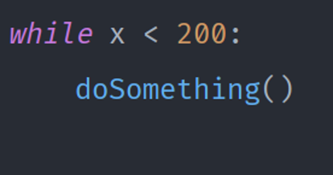

# Programmieren mit Python

# Turtle

Für das Programmieren von Python brauchen wir die Entwicklungsumgebung (IDE) PyCharm. Um ein neues Python File zu
erstellen, muss man den Projektordner mit der rechten Maustaste klicken → _New_ → _Python File_. Für das Filesoll der
Name der Aufgabe gewählt weden; z.B. `Aufgabe1`.

Für das Programm ist die _‘Turtle’_ zu verwenden. Um sie zu erstellen, muss es importiert werden mit der Zeile _import
turtle_. Nach dem Import muss das ‘Turtle’ in eine Variable gespeichert sein. Der variabelname darf ein frei gewählter
Name sein, hier zwei Beispiele:
`Alex = turtle.Turtle()` oder `Leo = turtle.Turtle()`.

Mit einer Turtle in Python können Strukturen gezeichnet werden. Dafür braucht es einige wichtige Befehle. Die Befehle
müssen immer mit der erstellten Variable verknüpft werden z.B.: _Leo.fd(90)_.

<table>
  <tr>
   <td><strong>Befehl</strong></td>
   <td><strong>Bezeichnung</strong></td>
  </tr>
  <tr>
   <td> <code>forward(90)</code> oder <code>fd(90)</code></td>
   <td>Lässt die Schildkröte 90 Pixel nach vorne fahren.</td>
  </tr>
  <tr>
   <td><code>backward(50)</code> oder <code>bk(90)</code></td>
   <td>Lässt die Schildkröte 50 Pixel nach hinten fahren.</td>
  </tr>
  <tr>
   <td><code>right(90)</code> oder <code>rt(90)</code>
   </td>
   <td>Die Schildkröte dreht sich 90 Grad nach rechts.</td>
  </tr>
  <tr>
   <td><code>left(90)</code> oder <code>lt(90)</code></td>
   <td>Die Schildkröte dreht sich 90 Grad nach links.</td>
  </tr>
  <tr>
   <td><code>dot(20)</code></td>
   <td>Macht einen Punkt mit 20 Pixel durchmesser.</td>
  </tr>
</table>

Mit diesen Grundsätzlichen Befehlen solltest du die Schildkröte bewegen können.

Damit dein Programm nach dem Zeichnen sich nicht sofort beendet, soll immer in der letzte Zeile `turtle.done()` stehen.

Um das Programm zu ausführen: Rechtsklick auf dein File → Run ‘_file_’.

## Aufgabe 1

Zeichne ein Rechteck.

## Aufgabe 2

Zeichne ein Haus.

## Aufgabe 3

Zeichne einen Stern.

<table>
  <tr>
   <td><code>color(‘blue’)</code></td>
   <td>Ändert die Farbe auf Blau</td>
  </tr>
  <tr>
   <td><code>penup()</code></td>
   <td>Lässt die Schildkröte nicht mehr Zeichnen, auch wenn sie herumfährt.</td>
  </tr>
  <tr>
   <td><code>pendown()</code></td>
   <td>Die Schildkröte zeichnet wieder.</td>
  </tr>
  <tr>
   <td><code>shape(‘arrow’)</code></td>
   <td>Ändert die Form der Schildkröte auf ein Pfeil.</td>
  </tr>
</table>

Falls du noch mehr Funktionen kennenlernen möchtest, besuche folgende Seiten:

[http://interactivepython.org/runestone/static/IntroPythonTurtles/Summary/summary.html](http://interactivepython.org/runestone/static/IntroPythonTurtles/Summary/summary.html)

[https://www.tutorialspoint.com/turtle-programming-in-python](https://www.tutorialspoint.com/turtle-programming-in-python)

## Aufgabe 4

Zeichne zwei Vierecke mit einer Schildkröte.

## Variablen mit Zahlen

Variablen kannst du nicht nur für deine ‘Turtle’ benutzen, sondern auch für Zahlen. 
Wenn du eine Variable erstellst,
musst du immer sein Wert auch mitgeben z.B.: `_x = 5_` oder `_x = 123_`.

Der Wert von Variablen kann überschrieben werden. Zum Beispiel, wenn man `x = x + 1` eingibt, wird der Wert um 1 erhöht.

## While Schleife

Eine While Schleife wiederholt seinen Inhalt. Dabei kannst du der While Schleife sagen, wie oft die Schleife den Code
wiederholen soll.

Wichtig ist dass der Code, der Wiederholt werden soll (`doSomething()` in diesem Beispiel) Mit einem Tab eingerückt
ist (Sich weiter rechts befindet als `while …`)

Wenn du wieder Code schreiben möchtest, der sich ausserhalb der Schleife befindet, schreibe dies wieder auf der höhe
vom `while` Statement.

## Aufgabe 5

Mache ein Viereck, benutze aber so wenig Code wie möglich.

## Aufgabe 6

Zeichne einen Kreis.

Tipp: Setze eine Variable, die deine while Schleife 360 Mal wiederholen lässt.

## Bonusaufgabe

Zeichne eine Spirale.

## If / Else

Dies heisst so viel wie “Wenn / Sonst”. Also mit `if` kann gewisser Code ausgeführt werden, aber NUR Wenn ein gewisse
Kondition zutrifft. Wenn dir dies etwas kompliziert vorkommt, hier ein praktisches Beispiel:

Falls `x` größer als 8 ist, soll der Pointer (die Turtle) um 100 Pixel nach vorne bewegt werden.

Um alle anderen fälle “abzufangen” benutzen wir das `else` Statement.

## Aufgabe 7

Geht die Turtle vorwärts oder rückwärts im oberen Beispiel?

## Konsole

In der Konsole kann mit dem Befehl print(Message) eine Nachricht in der Konsole ausgegeben werden. Dabei dürfen die
Apostrophe nicht vergessen werden. Dieser Text wird dann in der Konsole ausgegeben.

<pre>print('hallo welt')</pre>
Gibt folgendes in der Konsole aus:
<pre>hello</pre>

## Aufgabe 8

Speichere dein Alter in einer Variabel. \
Prüfe ob du unter oder über 18 Jahre alt bist.

Gib dann je nach Fall aus, ob du bereits Auto fahren darfst.

## Aufgabe 9

Erstelle eine Programm, welche eine zufällige Zahl generiert. 
Der Benutzer soll anschliessend über die Konsole die Zufallszahl erraten können. 
Falls der Benutzer falsch rät, sollst du ihm weiterhelfen indem du ihm sagst, ob er zu tief oder zu hoch geraten hat.
Der Benutzer kann solange raten bis er die richtige Zahl erraten hat.

Tipp: Einige Sachen in dieser Aufgabe wirst du mithilfe von Google lösen müssen.

## Aufgabe 10

Erweitere das bisherige Programm mit einem Zähler, welcher die Anzahl Versuche nach jedem Versuch auf der Konsole ausgibt.

## Aufgabe 11

Rock, Paper, Scissors

Implementiere ein Rock, Paper, Schissors. Die dazu benötigten Befehle solltest du bereits verwendet haben.

